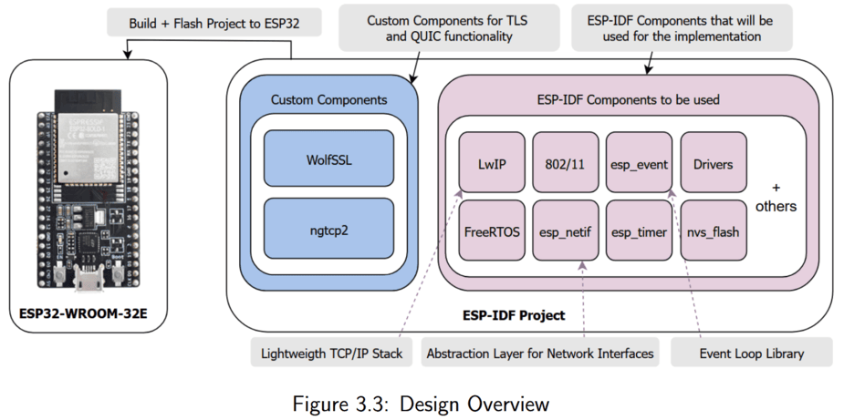

# QUIC for ESP32
This project implements a QUIC stack for ESP32. The stack consists of LwIP, WolfSSL and a ngtcp2 port for ESP-IDF. It was developed to test the feasibility of deploying QUIC — a modern transport protocol used by HTTP/3 — on resource-constrained embedded devices. It has been developed and tested on the ESP32-WROOM-32E.



## Instructions to run
1. The ESP32 and the machine running the server must be connected to the same WiFi access point. To connect the ESP32 to the access point, enter the WiFi credentials in the /main/wifi_connect.c file where instructed. 
2. Next, find the IP address of the machine that will run the server by using the follownig commands ``ìpconfig`` (Windows), ``ìp addr`` (Linux) or ``ìfconfig`` (MacOS). Take this IP address and place it into the REMOTE_HOST macro in the test_streams.c example (see components/quic/examples). 
3. Ensure that the port number in the components/quic/examples/quic_server.py file is the same as the REMOTE_PORT macro in the example you wish to run. 
4. Run the server on the server machine by navigating to components/quic/examples and running ```python3 quic_server.py```. This should run the server and output that the server is listening on all available network interfaces. At this stage, the ESP32 can connect to the server. 
5. To run the QUIC client on the ESP32, navigate to the components/quic/examples directory in in ESP-IDF terminal an run the following command``ìdf.py -p $PORT$ flash monitor`` . This will build the project, flash it to the ESP32 and monitor the output. The PORT should be replaced with the port number of the ESP32 on the machine being flashed from. 
6. The example should run, initiating a connection and transferring some data to the server. The default option opens multiple bidirectional streams and sends data over and receives data on each stream. If you wish to use more/less or unidirectional streams, see the instructions in components/quic/examples/README.md